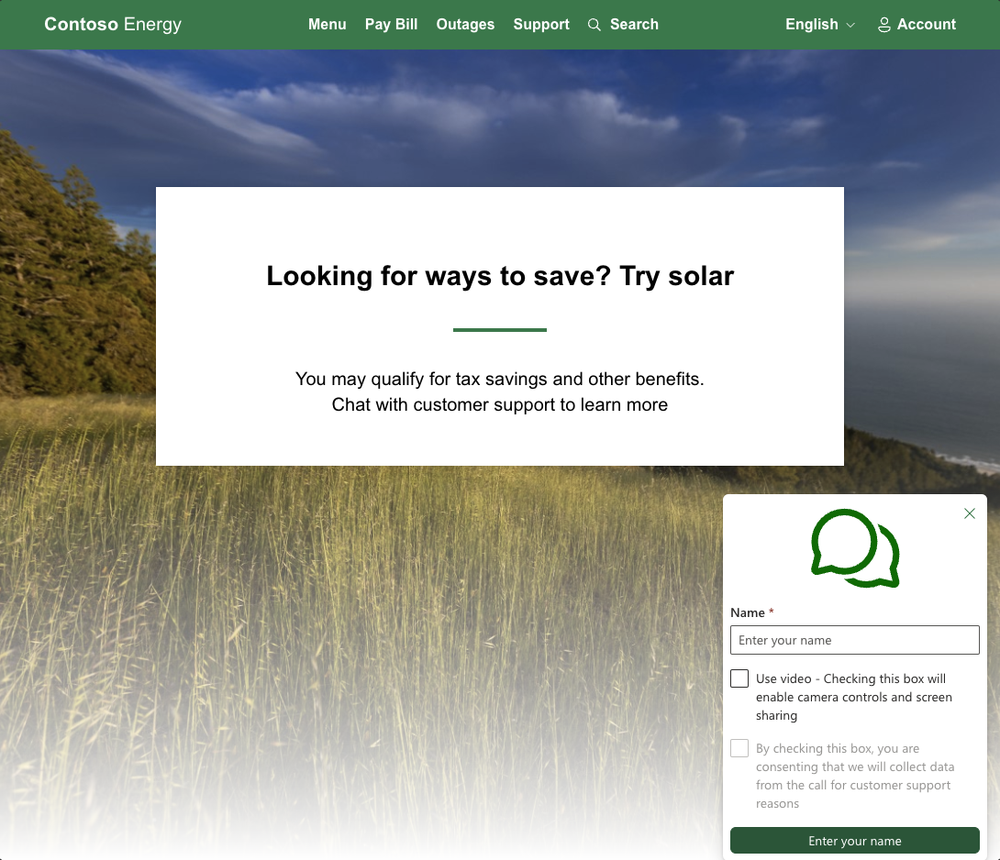

# Connect to your Customers using Azure Communication Services Calling Widget

This project is aimed to teach developers on how to create a Calling Widget using the Azure Communication UI Library.

Depending on your needs, you might need to create an experience for your customers to be able to get a hold of you with minimal setup on their part.
Calling Widget is a tool that is meant for allowing instant interaction, whether that is reaching out to customer support, having a quick call with your financial advisor, or other customer facing teams. The goal of this sample is to help make you one click away from your customers.

This sample is configured as a example application for a solar company's support page for Microsoft Build 2024. In this demo we showcase: 
- Screensharing between agent and customer
- Video Communications for a more personal experience
- Captions **(in public preview)** for a more accessible experience

Follow the setup steps [below](#pre-requisites) then use the blue button below to deploy the demo app to your Azure subscription. If you want to see a less complicated implementation see our [JavaScript quickstart](https://github.com/Azure-Samples/communication-services-javascript-quickstarts/tree/main/ui-library-click-to-call).

[](https://portal.azure.com/#create/Microsoft.Template/uri/https%3A%2F%2Fraw.githubusercontent.com%2FAzure-Samples%2Fcommunication-services-web-calling-widget-hero%2FBuild-demo-2024%2Fdeploy%2Fazuredeploy.json)




## ❤️ Feedback

We appreciate your feedback and energy helping us improve our services. [If you've tried the service, please give us feedback through this survey](https://microsoft.qualtrics.com/jfe/form/SV_9WTOR2ItSo0oFee). 

# Try It Out

## Pre-requisites
These steps **need** to be completed before you can complete the whole experience. Reach out to your Teams administrator if you have questions about setting up the Teams Voice Applications.

- [Visual Studio Code](https://code.visualstudio.com/) on one of the [supported platforms](https://code.visualstudio.com/docs/supporting/requirements#_platforms).
- [Node.js](https://nodejs.org/), Active LTS and Maintenance LTS versions [Node 18 LTS](https://nodejs.org/en) is recommended. Use the `node --version` command to check your version.
- An Azure Communication Services resource. [Create a Communications Resource](https://learn.microsoft.com/en-us/azure/communication-services/quickstarts/create-communication-resource?tabs=windows&pivots=platform-azp)
- Complete the Teams tenant setup in [Teams Call Queues](https://learn.microsoft.com/en-us/azure/communication-services/quickstarts/voice-video-calling/get-started-teams-auto-attendant#enable-interoperability-in-your-teams-tenant)
- Working with [Teams Call Queues](https://learn.microsoft.com/en-us/azure/communication-services/quickstarts/voice-video-calling/get-started-teams-call-queue) and Azure Communication Services.
- Working with [Teams Auto Attendants](https://learn.microsoft.com/en-us/azure/communication-services/quickstarts/voice-video-calling/get-started-teams-auto-attendant) and Azure Communication Services.

To just run the completed code, In the project directory, run:

### `npm run setup`

### Swap placeholders for identifiers
Go to the `server` folder and find the `appsettings.json` file.
replace all values here for you Azure communication Services resource and Teams voice apps.
```JSON
    "ResourceConnectionString": "ENTER_CONNECTION_STRING_HERE",
    "EndpointUrl":"ENTER_ENDPOINTURL_HERE",
    "CallQueueId": "REPLACE_WITH_CALL_QUEUE_ID",
    "AutoAttendantId": "REPLACE_WITH_AUTO_ATTENDANT_ID"
```
You can get these values from [Microsoft Graph](https://learn.microsoft.com/en-us/azure/communication-services/quickstarts/voice-video-calling/get-started-teams-call-queue#find-object-id-for-call-queue) and your [Azure Communication Services resource](https://learn.microsoft.com/en-us/azure/communication-services/quickstarts/create-communication-resource?tabs=windows&pivots=platform-azp)

### Run the application

In the project directory, run:

### `npm run start`

Runs the app in the development mode.\
Open [http://localhost:3000](http://localhost:3000) to view it in the browser.

Your applications server will be running on [http://localhost:8080](http://localhost:8080)

The page will reload if you make edits.\
You will also see any lint errors in the console.

### `npm run build`

Builds the app for production to the `build` folder.\
It correctly bundles React in production mode and optimizes the build for the best performance.

The build is minified and the filenames include the hashes.\
Your app is ready to be deployed!

## Deploying your Application

[](https://portal.azure.com/#create/Microsoft.Template/uri/https%3A%2F%2Fraw.githubusercontent.com%2FAzure-Samples%2Fcommunication-services-web-calling-widget-hero%2FBuild-demo-2024%2Fdeploy%2Fazuredeploy.json)

This repo supports our one click deployment tools. Interact with the button above to deploy our latest bundled release.

### Actions after deployment

Since this application is meant to interact with Teams Calling Applications we will need to do a few things following the completion of the deployment regarding your Azure Communication Services resource the app will use.


You have two different actions you can take when it comes to your `ResourceConnectionString`:
- Federate the new Azure communication services resource with your teams tenant that is made as part of your deployment. Please see our [documentation](https://learn.microsoft.com/en-us/azure/communication-services/quickstarts/voice-video-calling/get-started-teams-call-queue) on how to do that. **Work with your Teams admin if you have any questions about these docs**.
- Replace the `ResourceConnectionString` value for the application in your [Azure Portal](https://ms.portal.azure.com/) with the connection string that is already federated with your desired Teams tenant.

Next, you will need to replace in the Application settings the two Teams Calling Application placeholder values created by the deployment. These values are the Resource account ID's that can be retrieved using [Microsoft graph](https://learn.microsoft.com/en-us/azure/communication-services/quickstarts/voice-video-calling/get-started-teams-call-queue#find-object-id-for-call-queue):
- `AutoAttendantId`
- `CallQueueId`

Once these two values are replaced, your application is ready to use!

## Deploying with Azure tools

### Pre-requisites
- An Azure Communication Services Resource [federated with a Teams tenant](https://learn.microsoft.com/en-us/azure/communication-services/quickstarts/voice-video-calling/get-started-teams-call-queue)
- An [Azure Application service](https://azure.microsoft.com/en-ca/products/app-service)

This is a more involved process. First you will want to set up your `appsettings.json` in the `server` directory with your Azure Communication Services resource information, and your Teams Calling Application id's. Then you will need to run the following three commands:
- `npm run setup` 
- `npm run build`
- `npm run package`

Then you will use the [Azure tools extension](https://code.visualstudio.com/docs/azure/extensions) to deploy the `app/dist` folder to your existing Application service.


**Trademarks** This project may contain trademarks or logos for projects, products, or services. Authorized use of Microsoft trademarks or logos is subject to and must follow Microsoft’s Trademark & Brand Guidelines. Use of Microsoft trademarks or logos in modified versions of this project must not cause confusion or imply Microsoft sponsorship. Any use of third-party trademarks or logos are subject to those third-party’s policies.
